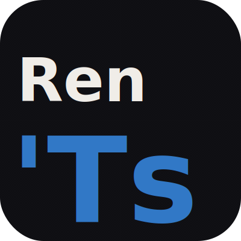

<div align="center">
  
</div>

# Ren'Ts

**在 Windows / macOS / Linux / iOS / Android 上游玩 Ren'Py 视觉小说的阅读器**


> ⚠️ 目前为早期测试版，欢迎试用并反馈问题。

---

## 这是什么

很多 Ren'Py 视觉小说只有 PC 版，没有手机版，安装也比较繁琐。Ren'Ts 是一个桌面阅读器，让你可以把 Ren'Py 游戏的脚本文件导入进来，直接在电脑上阅读游玩，不需要安装 Python 或 Ren'Py 本体。

---

## 下载

前往 [Releases 页面](../../releases) 下载最新版本：

- **macOS**：下载 `.dmg` 文件，打开后将 Ren'Ts 拖入应用程序文件夹
- **Windows**：下载 `.exe` 安装包，双击安装
- **Linux**：下载 `.AppImage` 文件，添加可执行权限后直接运行
- **iOS**：可以直接使用 [Web 版](#)，用 Safari 打开网址即可，无需安装。但受限于 iOS 的浏览器限制，Web 版**无法使用脚本转换工具**，需要提前在电脑上转换好脚本再导入。存档功能通过浏览器内置的 OPFS 实现，Safari 15.2+ 均可正常使用。想体验完整功能需自行编译安装（见下方说明）
- **Android**：下载 `.apk` 内测包，安装时允许"来自未知来源的应用"即可

### macOS 打开时提示"无法验证开发者"？

这是正常现象，因为目前版本尚未购买苹果开发者证书。解决方法：

1. 右键点击 Ren'Ts 图标
2. 选择「打开」
3. 在弹出的对话框中再次点击「打开」

之后就可以正常使用了，只需操作一次。

---

## 使用方法

### 你需要准备什么

游玩一款游戏需要两样东西：

1. **游戏的脚本文件**（`.rpy` 或 `.rpyc` 文件）— 见下方「如何获取脚本文件」
2. **游戏的素材文件**（图片、音频等）— 同样在游戏安装目录中，转换时会自动打包进 `.zip`

> Ren'Ts 本身不包含任何游戏内容，需要你自己准备。请确认你拥有对应游戏的合法使用权。

### 如何获取脚本文件

大多数 Ren'Py 游戏的文件都可以直接在安装目录中找到，不需要任何破解或特殊工具。

**Windows / macOS / Linux：**

1. 找到游戏的安装目录（Steam 游戏可右键 → 管理 → 浏览本地文件）
2. 打开其中的 `game/` 文件夹
3. 里面的 `.rpy` 文件就是脚本，图片和音频也在同一目录下

**如果只有 `.rpyc` 文件而没有 `.rpy` 文件：**

没问题，转换工具现已支持直接读取编译后的 `.rpyc` 文件。工具会自动解析其中的 AST（抽象语法树），生成与 `.rpy` 路径完全一致的 `.rrs` 脚本，包括对话、选项、场景切换、语音行等内容。若同一文件同时存在 `.rpy` 和 `.rpyc`，优先使用 `.rpy`。

### 第一步：找到游戏文件

在你电脑上找到 Ren'Py 游戏的安装目录，里面通常有一个 `game/` 文件夹，其中包含 `.rpy` 脚本文件以及 `images/`、`audio/` 等子文件夹。

### 第二步：转换脚本

1. 打开 Ren'Ts
2. 点击左上角的**工具图标**
3. 在「游戏目录」一栏填入游戏的 `game/` 文件夹路径
4. 按照提示填写其他信息
5. 点击「转换」，等待完成后会生成一个 `.zip` 文件

### 第三步：开始游玩

转换生成的 `.zip` 文件（即 **ZipFS**）包含了转换后的脚本和全部素材资源，是 Ren'Ts 的标准游戏包格式。在主界面点击「打开游戏」，选择该 `.zip` 文件即可直接开始游玩，无需解压，也无需保留原始游戏目录。

> **支持的输入格式**  
> 转换工具支持以下三种输入：
> - `.rpy` — Ren'Py 明文脚本（最优先）
> - `.rpyc` — Ren'Py 编译脚本（自动解析 AST，与 `.rpy` 等效）
> - `.rpa` — Ren'Py 资源包（图片、音频等素材）

> **什么是 ZipFS？**  
> ZipFS 是 Ren'Ts 自有的游戏包格式，本质上是一个标准 ZIP 压缩文件，内含：
> - `data/` 目录：转换后的 `.rrs` 脚本文件和 `manifest.json`
> - `images/`、`audio/` 等目录：原封不动打包进来的素材文件
>
> 引擎在运行时直接从 ZIP 内按路径读取文件，不需要解压到磁盘。这样一来，**一个 `.zip` 就是一个完整的游戏**，方便携带和备份。转换时素材文件会被直接流式写入 ZIP，内存占用与游戏总大小无关。

---

## 注意事项

- **部分语法不支持**：Ren'Ts 目前不支持全部 Ren'Py 语法，复杂脚本可能无法正常运行，欢迎反馈具体游戏名称
- **素材自动打包**：转换时图片、音频、视频等素材文件会被一并流式写入 `.zip`，无需单独保留原游戏目录
- **iOS 需自行编译**：受限于苹果开发者账号费用，暂无法直接分发 iOS 安装包

- **Minigame 自动检测**：某些游戏包含无法在 Ren'Ts 内复现的原生交互片段——例如文字填空、前戏小游戏等，它们由复杂的 Ren'Py screen 和 Python 逻辑驱动，没有普通对话流程。转换器会在处理每个 `.rpy` 文件时自动检测这类结构：若一个文件的入口 label 没有对话、只调用 screen、且整个调用链最终只跳出到文件外的唯一一个 label，则该文件会被识别为 minigame，转换结果替换为一个直通存根：

  ```
  label <入口label> {
    jump <出口label>;
  }
  ```

  这样游戏剧情可以照常推进，跳过无法执行的 minigame 片段。检测算法纯静态分析（无需运行脚本），同时支持 `call screen` / `show screen` 两种启动方式，以及 `renpy.jump()` 调用藏在 `init python` 函数体内的情况。若某个入口有多个可能的外部出口（无法确定跳往何处），转换器会保留警告日志并回退到普通转换，不会静默出错。

---

## 反馈问题

遇到闪退、显示异常、某款游戏无法读取等情况，欢迎在 [Issues](../../issues) 页面提交，注明游戏名称和出现问题的步骤，我会尽快跟进。

---

## 常见问题

**Q：支持哪些游戏？**  
A：理论上支持大多数使用标准 Ren'Py 语法的游戏，但目前仍有部分高级语法尚未实现。如果你的游戏无法运行，欢迎提 Issue。

**Q：iOS 怎么安装？**  
A：推荐先试试 [Web 版](#)，用 Safari 打开网址即可，不需要安装任何东西。存档功能通过 OPFS 实现，Safari 15.2+ 均正常支持。主要限制是**无法在 iOS 上直接转换游戏脚本**（File System Access API 在 iOS Safari 不可用），需要先在电脑上用桌面版或 Chrome/Edge 转换好 `.zip`，再在 iOS 上打开。如果想要完整的转换体验，需要自己用 Xcode 编译安装，对普通用户门槛较高。由于上架 App Store 需要每年 ¥688 的苹果开发者账号，暂时无法直接分发安装包，如果你愿意赞助欢迎联系 👀

**Q：转换出来的文件可以分享给别人吗？**  
A：转换文件本身只是格式转换，版权仍属于原游戏作者，请勿在未获授权的情况下分发。
